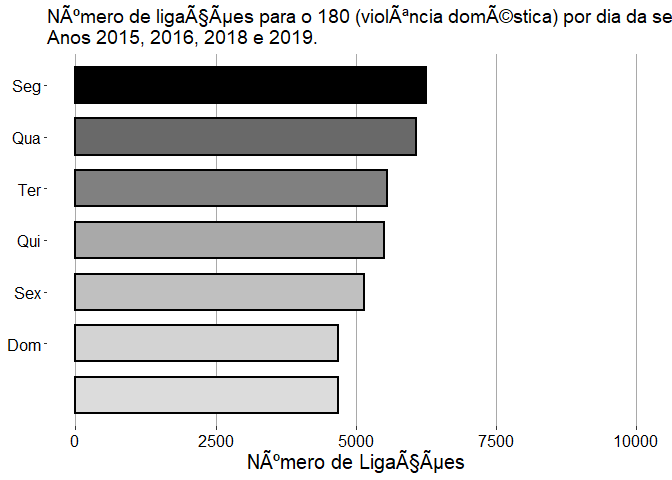

<!-- README.md is generated from README.Rmd. Please edit that file -->

# projeto\_curso

<!-- badges: start -->
<!-- badges: end -->

The goal of projeto\_curso is to …

What is special about using `README.Rmd` instead of just `README.md`?
You can include R chunks like so:

``` r
summary(cars)
#>      speed           dist       
#>  Min.   : 4.0   Min.   :  2.00  
#>  1st Qu.:12.0   1st Qu.: 26.00  
#>  Median :15.0   Median : 36.00  
#>  Mean   :15.4   Mean   : 42.98  
#>  3rd Qu.:19.0   3rd Qu.: 56.00  
#>  Max.   :25.0   Max.   :120.00
```

You’ll still need to render `README.Rmd` regularly, to keep `README.md`
up-to-date. `devtools::build_readme()` is handy for this. You could also
use GitHub Actions to re-render `README.Rmd` every time you push. An
example workflow can be found here:
<https://github.com/r-lib/actions/tree/master/examples>.

You can also embed plots, for example:

    #> 
    #> Attaching package: 'cowplot'
    #> The following object is masked from 'package:ggthemes':
    #> 
    #>     theme_map
    #> -- Attaching packages --------------------------------------- tidyverse 1.3.1 --
    #> v ggplot2 3.3.3     v purrr   0.3.4
    #> v tibble  3.1.1     v dplyr   1.0.6
    #> v tidyr   1.1.3     v stringr 1.4.0
    #> v readr   1.4.0     v forcats 0.5.1
    #> -- Conflicts ------------------------------------------ tidyverse_conflicts() --
    #> x dplyr::filter() masks stats::filter()
    #> x dplyr::lag()    masks stats::lag()
    #> Warning: Unknown levels in `f`: sáb

<!-- -->

In that case, don’t forget to commit and push the resulting figure
files, so they display on GitHub.
